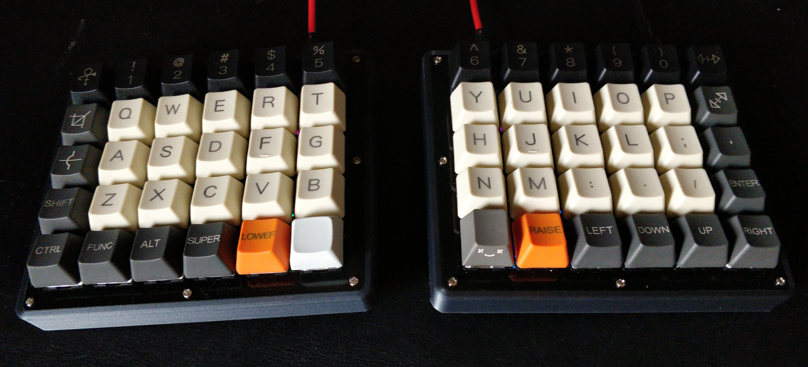
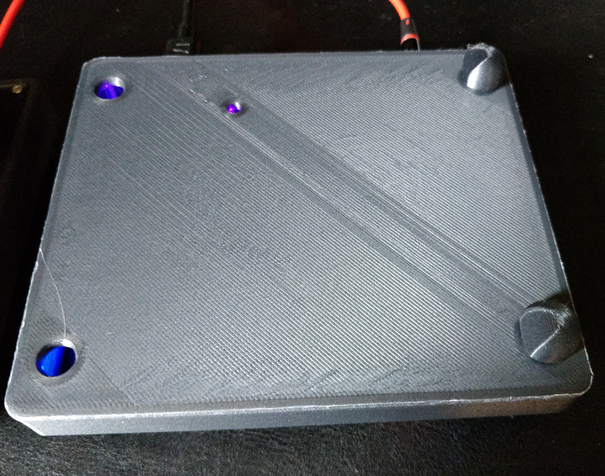
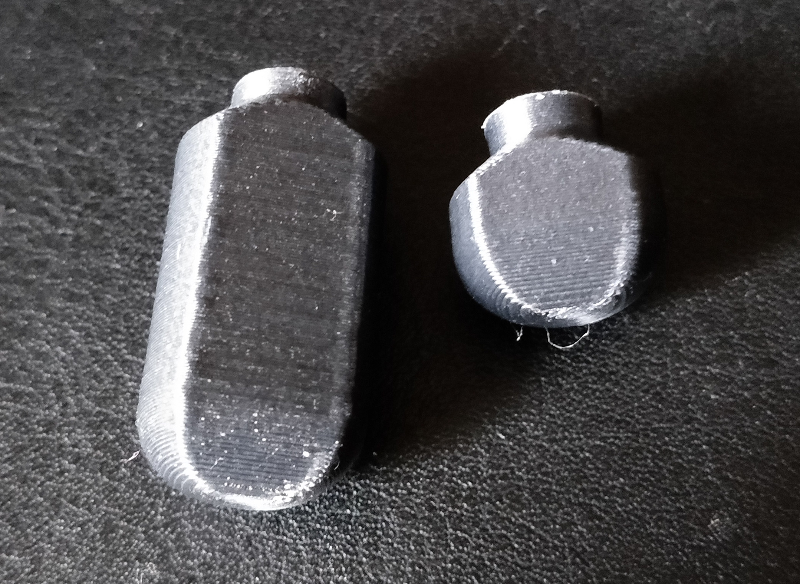
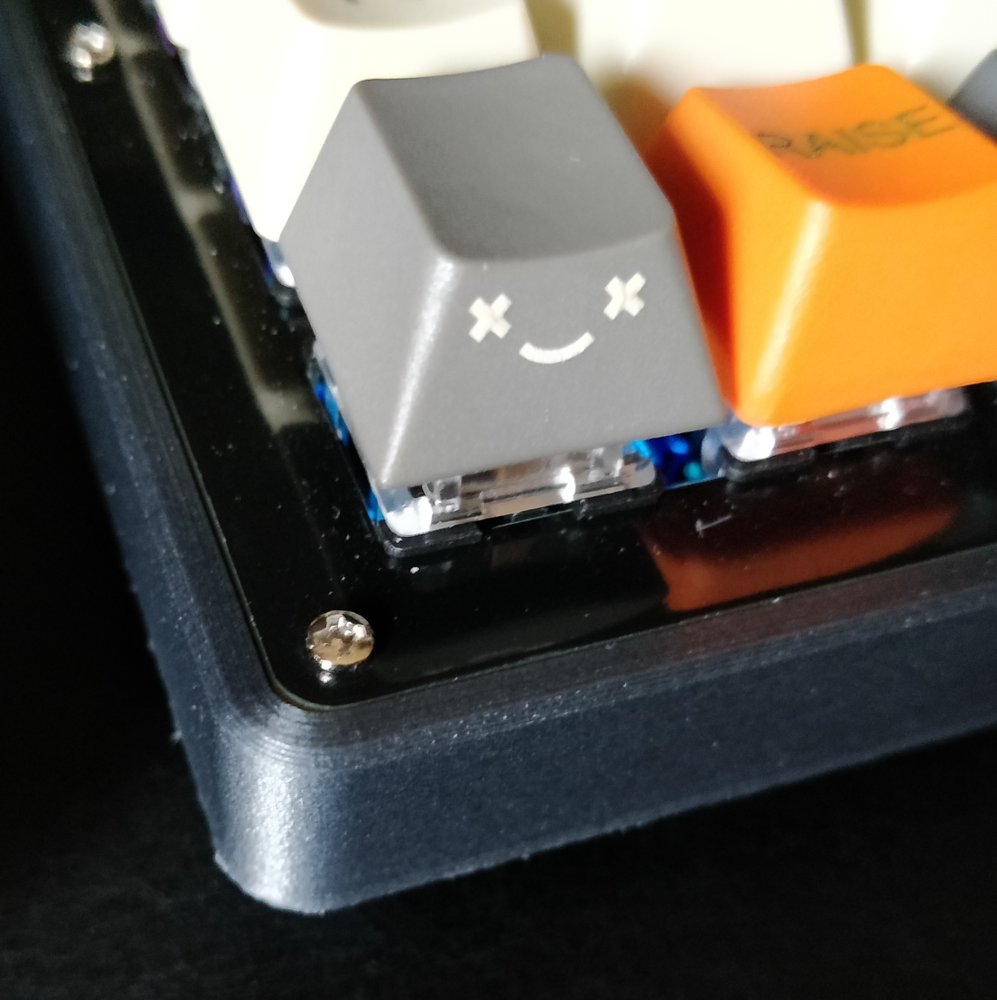

# 3D Printed Case for Nyquist Rev3.

**by jeffeb3**

This case is for the Nyquist Rev 3 keyboard from keeb.io. This case is intended to be 3D printed,
and fits on most modern FDM printers comfortably. It uses the PCB/FR4 top plate from keeb.io, which
gives it a great looking finish.

_This is using 4x 10mm pegs only_

### Parts Needed

I built the Nyquist Rev3 from parts from
[keeb.io](https://keeb.io/collections/frontpage/products/nyquist-keyboard). First, follow those
instructions and advice for getting a functional keyboard.

This also uses the [PCB/FR4 case from
keeb.io](https://keeb.io/collections/cases-plates/products/stainless-steel-nyquist-plates). I used
this case first, and it is cleaner, and more accurate than a top plate that I can 3D print. It also
isn't very expensive, and makes a good interim/backup case.

Rough parts list:
 - [Keeb.io Nyquist Rev3 PCB](https://keeb.io/collections/frontpage/products/nyquist-keyboard)
 - Switches
 - Keycaps
 - [PCB Case top](https://keeb.io/collections/cases-plates/products/stainless-steel-nyquist-plates)
 - 16x PCB Case M2 screws
 - TRRS cable, USB C cable

3D Printed parts list:
- [Case right, for the right keyboard](Nyquist_Case-case_right.stl)
- [Case left, for the left keyboard](Nyquist_Case-case_left.stl)
- [4x tall pegs](Nyquist_Case-peg_15.stl)
- [4x small pegs, or leave them blank for the lowest profile](Nyquist_Case-peg_5.stl)

### Tenting

Tenting is accomplished by custom pegs. There are four holes for pegs in the corners. They are close
enough to the corners to provide stability, and you can print the length of pegs you want to
completely customize the fit.

Included are STL files for various lengths of pegs. The number suffix roughly indicates the length
of the peg from the base of the case to the tip, but it might be 0.25mm-0.5mm off, because of the
various round overs and chamfers. If you want an in between size, scale the height in your slicer
from the closest length. It should scale well enough to change it a few millimeters.

### RGB LEDs underneath

I have black filament in the printer right now. I think this would work well enough with clear or
maybe even white filament. If you print a case with a lighter filament, share some pretty images of
the lights with me, please. :)

### Printing

**Tips**

The cases are large enough that warping is a high risk. I printed them with a brim and they cleaned
up nicely.

The pegs have a small surface area and are pretty tall, so I also printed them with a brim. These
brims clean up nicely, and they don't affect the fit.

I printed with 3 perimeters, 6 top/bottom layers/30% infill, which are my goto settings for
functional prints. They are rock solid and very stiff, even when I'm hammering on the keys.

### Enjoy, share

Please let me ([@jeffeb3, on github](https://github.com/jeffeb3), or on [twitter](https://twitter.com/jeffeb3)) know if you build this case. I like to know about
how people are using the stuff I share. :+1:

