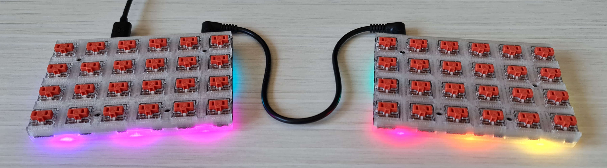
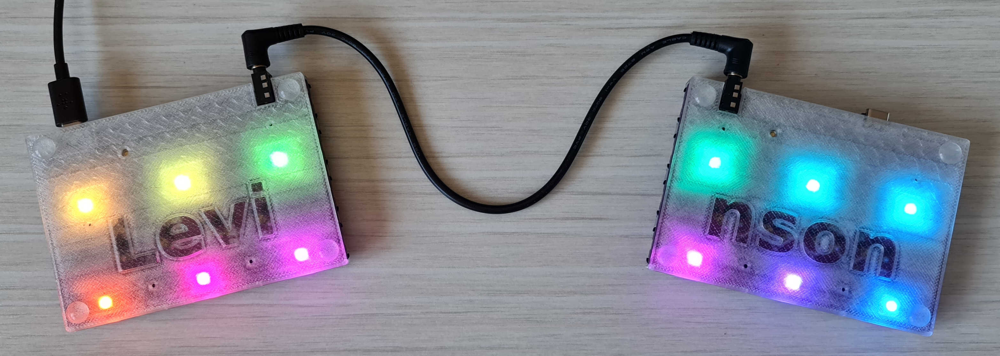

Levinson Choc case
==================

This is a parametric two-part CAD model of a case for the Nyquist PCB rev3 with
Kailh PG1350 switches and the undesirable bits broken off.  Slightly slanted
forward to accomodate TRRS jack cables.

It won't be a great hassle to adapt this for rev3.5.  It will be able to lay
flat in that revision, saving print time and material.  In general the jack
connector was a major pain point (though there don't seem to be any USB C cables
angled on both sides available yet).

You'll need
-----------
 - https://keeb.io/products/nyquist-keyboard[Nyquist/Levinson] rev3
   with some Kailh PG1350 switches soldered in
 - an FDM 3D printer (developed on a
   https://shop.prusa3d.com/en/3d-printers/994-original-prusa-mini.html[Prusa Mini+])
 - ideally clear PETG (photos show
   https://shop.prusa3d.com/en/prusament/1216-prusament-petg-clear-1kg.html[Prusament PETG Clear])
 - long enough M2 screws (e.g. from the craptastic and useless keeb.io FR4 case)
 - https://www.aliexpress.com/item/32891555457.html[2.5mm high silicone pads]
 - https://solvespace.com[Solvespace] 3 to generate a triangle mesh for printing
   from the model

Print settings
--------------
 - recommended is the default 0.4mm nozzle with 0.2mm layer height,
   quality settings
 - increase extrusion width for solid infills until the print looks clear enough
   (0.55mm produced a good result)
 - the cover looks better with right-angled infills 
 - use the Hilbert Curve for the bottom fill pattern to make it look nicer
 - similarly recommended is a textured sheet for the heatbed

Both halves fit onto the Mini's print area.  Increase heatbed temperature
by approximately 5 degrees Celsius if printing from PLA then, or otherwise make
sure that corners don't lift off.  Increase the temperature mid-print to salvage
if you see this happening, it should lay back down.

Issues
------
 - it may wobble, it's also not a perfect fit, presumably due to bad
   measurements (some probably due to the pitch being 3/4" rather than 19mm;
   this has proven hard to fix)
 - screw holes in the cover need some fiddling around but generally work
 - Solvespace is slow at computing the cover parts.  You can remove them
   entirely, they serve an aesthetic purpose.

License
-------
https://creativecommons.org/publicdomain/zero/1.0/

To the extent possible under law, Přemysl Eric Janouch has waived all copyright
and related or neighboring rights to the Levinson Choc case.
This work is published from the Czech Republic.
